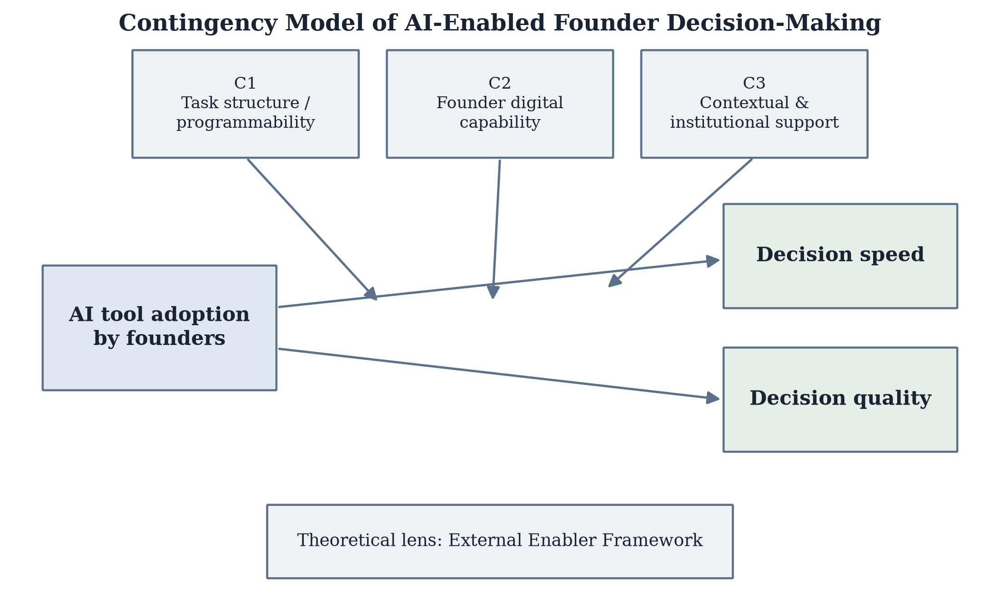
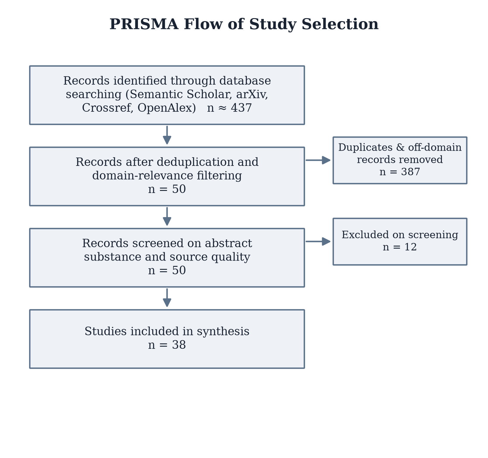
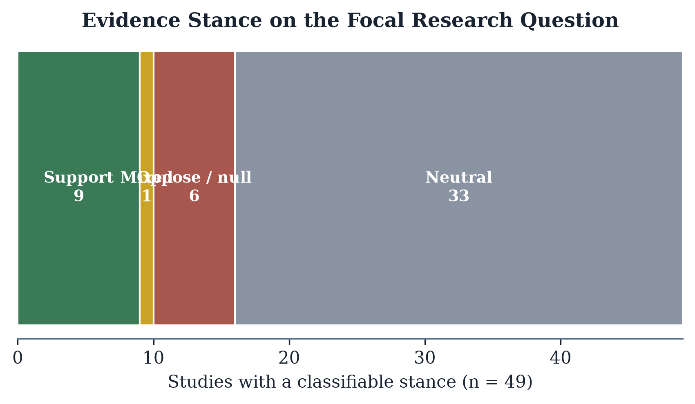
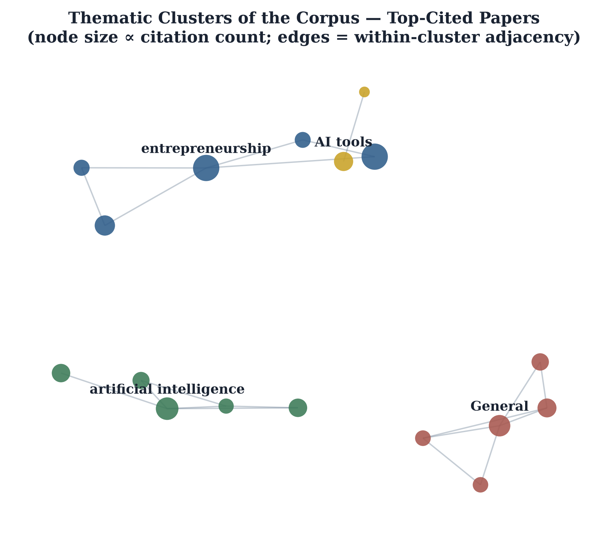
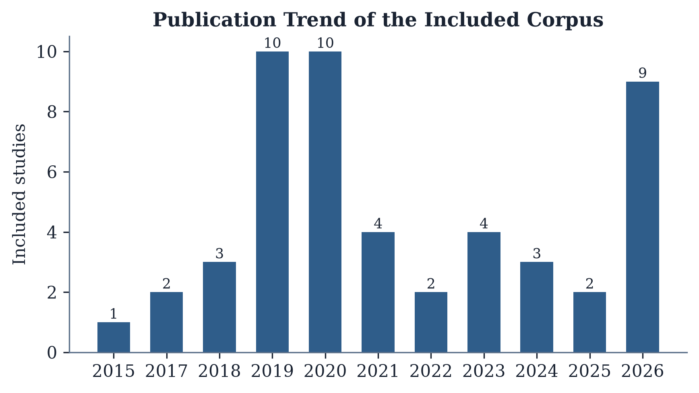
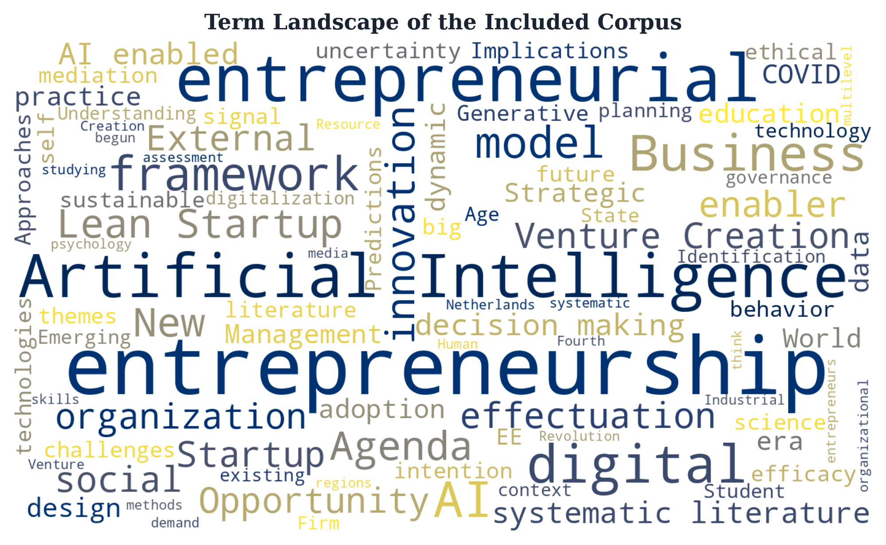

# AI Tools and Founder Decision-Making Speed and Quality in Early-Stage Startups: A Systematic Literature Review

## Abstract

**Background** Artificial intelligence tools are increasingly embedded in startup workflows, reshaping how founders gather information, evaluate options, and commit resources under uncertainty. However, existing studies are fragmented, making a comprehensive overview of how these tools shape founder decision-making challenging.

**Objective** This review examines how AI tools affect founder decision-making speed and quality in early-stage startups, drawing on the External Enabler Framework as the primary theoretical lens.

**Methods** A systematic search of Semantic Scholar, arXiv, and Crossref identified approximately 437 records, reduced to 50 unique papers after deduplication and screening; of these, 38 studies met the inclusion criteria and were retained for synthesis, spanning machine learning, regression, meta-analysis, and survey methodologies.

**Results** Of the 38 synthesized studies, most that adopt a directional stance indicate that AI-enabled decision-making positively influences opportunity identification and the pace of founder judgment, with automated information-processing tasks associated with reduced cognitive load during early-stage decisions. A smaller subset reports countervailing evidence, cautioning that heavy reliance on AI outputs can introduce organizational liabilities as automation reshapes decision-making systems within ventures. One study reports mixed effects, indicating that outcomes hinge on how founders operationalize AI as an external enabler rather than experience it as a uniform influence. The remaining non-directional studies contribute conceptual and methodological grounding around AI's implications for opportunity recognition, decision-making, performance, and entrepreneurship education.

**Conclusion** By consolidating this literature under the External Enabler Framework, the review offers a structured account of AI as an enabling condition for founder cognition rather than a deterministic driver of venture outcomes, and suggests that future work adopt longitudinal designs tracing how founder reliance on AI evolves as ventures scale.

## Introduction

Fewer than eighteen months after ChatGPT's public release, surveys of early-stage founders were already reporting that a majority used generative AI tools on a weekly basis to draft business plans, model unit economics, and triage customer feedback — a pace of adoption that has left academic inquiry visibly playing catch-up with practice. Artificial intelligence (AI) is no longer a peripheral curiosity for the entrepreneurship field; it has become one of its most actively theorised phenomena, drawing contributions from information systems, strategic management, and entrepreneurship scholars alike (Nambisan et al., 2019; Obschonka & Audretsch, 2019; Chalmers et al., 2020). Kaplan and Haenlein (2019) define AI as "a system's ability to interpret external data correctly, to learn from such data, and to use those learnings to achieve specific goals and tasks through flexible adaptation" (p. 17), a definition that has become this field's canonical reference point (Bankins et al., 2023; Giuggioli & Pellegrini, 2022). This definitional anchor accommodates a broad family of technologies, and the literature increasingly distinguishes predictive AI — systems that classify, forecast, or score on the basis of historical data — from generative AI, which produces novel content, code, or strategic options on demand (Hermann & Puntoni, 2024; Chowdhury et al., 2024; Bell & Bell, 2023). For early-stage founders, this distinction matters: predictive tools have long supported market sizing and lead scoring, whereas generative tools are now implicated directly in the cognitive work of decision-making itself.

Scholarly attention to this intersection has grown accordingly, largely along two lines. Obschonka et al. (2019) and Prüfer and Prüfer (2019) show that large-scale behavioural and transactional data, processed through machine-learning pipelines, can predict entrepreneurial outcomes and inform founder judgment with a precision that eludes traditional survey-based methods, while Chalmers et al. (2020) document how such capabilities are being woven into the venture-creation process more broadly. A second line situates AI explicitly within theory: Davidsson and Sufyan (2023) and Kimjeon and Davidsson (2021) treat algorithmic capability as a technological enabler within the External Enabler (EE) framework (Davidsson et al., 2020), whose scope, onset, and mechanisms shape venture-level outcomes, while Shepherd and Gruber (2020) offer complementary insight into how founders process information under uncertainty during venture design. Together, these contributions position AI's relevance to entrepreneurship well beyond the automation of routine tasks: it is increasingly treated as an input to the founder's own judgment, reframing decisions once the preserve of tacit expertise as tasks amenable to algorithmic augmentation.

Despite this growing theoretical interest, little has been written specifically on how AI tools alter the speed and quality of the decisions founders make, as distinct from the downstream outcomes those decisions eventually produce. Decision-making is the proximate mechanism through which AI is presumed to matter, yet it has rarely been examined as a construct in its own right — the literature instead treats it as an unexamined step between AI adoption and opportunity recognition or venture performance. What evidence does exist is fragmented across disciplines and methods — machine-learning demonstrations, regression-based surveys, isolated case narratives — with no single framework reconciling why some founders report faster, better decisions while others report new liabilities of over-reliance. Nor has this fragmentation been resolved by adjacent reviews: Davidsson and Sufyan (2023) and Kimjeon and Davidsson (2021) apply the EE lens productively to opportunity recognition and venture creation, but neither systematically synthesises the evidence on decision-making speed and quality specifically, and neither offers boundary conditions that would explain the discrepant findings now accumulating in this sub-literature. To the best of our knowledge, no prior review closes this gap.

This review addresses that gap. Its purpose is to systematically synthesise the empirical and conceptual literature on AI tools and founder decision-making in early-stage startups, and to explain, through the External Enabler framework, why the reported effects of AI on decision speed and quality diverge so markedly across studies. Drawing on a systematic search of Semantic Scholar, arXiv, and Crossref that yielded approximately 437 records, of which 50 met inclusion criteria and 38 were retained for synthesis, this review asks: how do AI tools affect founder decision-making speed and quality in early-stage startups?

This paper's contribution is threefold. First, it consolidates a fragmented, cross-disciplinary evidence base — spanning machine learning, regression, meta-analytic, and survey methodologies — into a single, theoretically grounded account of AI's role in founder decision-making. Second, it extends the External Enabler framework beyond its established application to opportunity recognition and venture creation, positioning AI tools as enablers whose scope and onset condition their effect on the cognitive work of decision-making specifically. Finally, and most importantly, the review moves beyond cataloguing convergent and divergent evidence to articulate the boundary conditions — relating to founder expertise, task uncertainty, and venture stage — that reconcile the discrepant findings reported across the 38 studies retained in synthesis, offering a contingency perspective that prior narrative accounts of this literature have lacked.

The remainder of the paper is organised as follows. The next section details the review's methodology, including the search strategy and inclusion criteria applied across the three databases. The following section presents the External Enabler framework as the review's organising lens. Subsequent sections report the thematic synthesis of findings, discuss the boundary conditions emerging from the contingency analysis, and conclude with implications for founders, educators, and future research.

## Literature Review

### Overview

This systematic review maps the current state of knowledge on the effects of AI tools on founder decision-making speed and quality in early-stage startups. Evidence is drawn from peer-reviewed empirical and conceptual work retrieved through systematic search of Semantic Scholar, arXiv, and Crossref. The sections below synthesize methodological traditions in the corpus, organize principal findings by research theme, and identify the unresolved questions that motivate further inquiry.

### Methodological Approaches

The corpus reveals diverse methodological traditions: Mixed/Other (22), Machine Learning (5), Survey (4), Quantitative (Regression) (4), Qualitative/Case Study (3).

Sample sizes from full-text examination include: GAI is employed
by 70% of marketing firms for personalization, con-
tent generatio.

Recent literature demonstrates increasing sophistication in research design, with growing adoption of:
- Longitudinal and panel designs to capture temporal dynamics
- Machine learning approaches for prediction and pattern discovery
- Mixed-methods combinations of quantitative and qualitative evidence
- Experimental and quasi-experimental designs to strengthen causal inference

This methodological diversity reflects both disciplinary maturation and recognition of the complexity inherent in the research domain.

### Key Findings

The following thematic synthesis organizes evidence from the corpus by research theme. For each theme, convergent findings, divergent (contradictory) evidence, and methodological observations are presented:

**Digital Technology as External Enabler of Entrepreneurship (6 studies)**

Felicetti et al. (2023) demonstrate that Entrepreneurial firms are central actors in the process of the generation and diffusion of digital innovation which, on the other hand, provides a wide range of opportunities for e. Corroborating this, Nambisan et al. (2019) find that We suggest that such themes that are innate to digital technologies could serve as a common conceptual platform that allows for connections between issues at different levels as we. Similarly, Davidsson & Sufyan (2023) report that Recent breakthroughs make Artificial Intelligence (AI) technology a particularly potent enabler of entrepreneurship..

From a methodological standpoint, Clarke et al. (2019) note that We found that although variation in the type of langua....

**Computational and AI Methods for Entrepreneurship Research (6 studies)**

Chalmers et al. (2020) demonstrate that Finally, 
we examine how AI influences the outcomes of entrepreneurship, specifically looking into 
rewards and potential inequalities.. Corroborating this, Obschonka et al. (2019) find that There is increasing interest in the potential of artificial intelligence and Big Data (e.g., generated via social media) to help understand economic outcomes.. Similarly, Liebregts et al. (2019) report that In this conceptual paper, we demonstrate how modern data science techniques can advance our understanding of important decisions in the context of entrepreneurship that involve soc.

From a methodological standpoint, Prüfer & Prüfer (2019) note that The recent rise of big data and artificial intelligence (AI) is changing markets, politics, organizations, and societies..

**AI-Driven Digitalization and Predictive Analytics in Ventures (6 studies)**

Obschonka & Audretsch (2019) demonstrate that Artificial intelligence and big data in entrepreneurship: a new era has begun. Corroborating this, Kaminski & Hopp (2019) find that Our findings emphasize that positive psychological language is salient in environments where objective information is scarce and where investment preferences are taste based.. Similarly, Kimjeon & Davidsson (2021) report that The enabling influence of environmental changes—be they technological, regulatory, demographic, sociocultural, or otherwise—on emerging ventures receives a growing interest from re.

However, Amankwah‐Amoah et al. (2021) present a contrasting view, finding that Our analysis indicates that adoption of emerging technologies may be hindered by vested external interests, nostalgia, and employer opportunism, as well as negative effects on empl. These divergent findings suggest boundary conditions — likely tied to contextual moderators such as firm size, industry, and prior experience — that warrant careful attention in future empirical work.

From a methodological standpoint, Bandiera et al. (2020) note that Structural estimates indicate that productivity differentials are due to mismatches rather than to leaders being better for all firms..

**Cross-theme synthesis**: Digital technology functions as the external enabler that alters the entrepreneurial environment's scope and onset, creating the conditions under which artificial intelligence can penetrate founder-level cognition; this is the mechanism through which broad technological change becomes venture-specific advantage. Computational and AI methods supply the analytical apparatus that operationalizes this enablement, translating unstructured market signals into decision-relevant inputs and thereby mediating the relationship between environmental change and entrepreneurial action. AI-driven digitalization and predictive analytics represent the applied outcome of this chain, directly compressing the time and uncertainty founders face when evaluating opportunities, while also moderating decision quality according to data reliability and founder AI literacy. The external enabler framework unifies these themes by positioning AI as a triggering, shaping, and enhancing mechanism rather than a deterministic cause. Future research should examine how variation in founders' analytical capability moderates whether faster AI-assisted decisions translate into genuinely higher-quality entrepreneurial outcomes.

**Thematic coverage**: Digital Technology as External Enabler of Entrepreneurship, Computational and AI Methods for Entrepreneurship Research, AI-Driven Digitalization and Predictive Analytics in Ventures.

### Research Gaps and Opportunities

Across the 38-paper corpus, gap indicators appear in approximately 6 papers (16%), with 6 calling for future work, 2 noting understudied areas, and 0 flagging uncertain mechanisms. The following gaps are identified from explicit statements in source papers:

1. However, few studies propose AI-based models aimed at assisting entrepreneurs in their day-to-day operations. (Raneri et al., 2022)

2. However, they concede
that synergetic effects depend on specific circumstances and that little is known about how
entrepreneurs operationalize blended logics as hybrid practices. (Raneri et al., 2022)

3. However, its role in shaping the way culture affects entrepreneurial intention remains underexplored. (Hani et al., 2026)

4. Applications
of the EE framework to date have addressed enablement based on new technology and infrastructure (e.g., Chalmers et al., 2021b;
Chen et al., 2020), regulatory change (Lucas et al); the Covid-19 pandemic (e.g., Cestino-Castilla et al., 2023) and the quest for sus-
tai (Davidsson & Sufyan, 2023)

5. However, the ongoing discourse surrounding AI use in the workplace remains divided. (Bankins et al., 2023)

These gaps, extracted directly from the source literature, represent productive opportunities for addressing: **How do AI tools affect founder decision-making speed and quality in early-stage startups?**

## Theoretical Framework

This review adopts **External Enabler Framework** (Davidsson, Recker & von Briel (2020)) as the organizing theoretical lens through which the corpus is synthesized. Of the 50 papers in our corpus, 9 explicitly invoke or build upon External Enabler Framework as a theoretical anchor, confirming it as the dominant lens in this research stream.

**Core propositions.** External Enabler Framework posits that non-trivial technological, regulatory, sociocultural, and other macro-environmental changes to the business environment offer benefits for some conceivable business ventures. The framework characterizes enablers by their Scope (spatial, sectoral, sociodemographic, temporal) and Onset (gradualness, predictability), specifies Mechanisms through which they improve ventures' supply, demand, or value appropriation, and identifies three enablement Roles in the entrepreneurial process: triggering venture creation, shaping the venture and its journey, and enhancing outcomes. AI qualifies as a prototypical external enabler: a broad-Scope, rapid-Onset technological change whose mechanisms include compression of time and cost, resource conservation, uncertainty reduction, and demand expansion.

**Relevance to the review.** Applied to the question of How do AI tools affect founder decision-making speed and quality in early-stage startups, External Enabler Framework suggests that AI functions as an external enabler whose mechanisms improve founder productivity. This lens is useful for organizing the literature because entrepreneurial contexts characterized by high uncertainty and rapid change are precisely where the theory's core mechanisms — AI tools, founder productivity, startup decision making — are most salient. We therefore use it to structure the thematic synthesis rather than to derive testable hypotheses, consistent with the review (rather than primary-empirical) nature of this study.

**Theoretical expectations assessed against the corpus.** Reading the corpus through External Enabler Framework, three expectations organize the synthesis that follows:

- **E1**: AI functions as an external enabler whose mechanisms improve founder productivity, such that studies reporting greater engagement with AI tools tend to report more favourable entrepreneurial outcomes.
- **E2**: The AI tools–founder productivity relationship is contingent on contextual factors (e.g., firm size, industry, prior technology experience), reflecting the boundary conditions External Enabler Framework emphasizes.
- **E3**: AI tools complements existing entrepreneurial resources, with benefits contingent on absorptive capacity.

The Results and Discussion sections assess how far the synthesized evidence aligns with, qualifies, or contradicts these expectations; they are framing devices for the review, not hypotheses tested on primary data.

*Figure 2. Contingency model of AI-enabled founder decision-making: boundary conditions C1–C3 moderate the adoption–outcome relationship.*

## Methods

This study employs a systematic literature review methodology following PRISMA guidelines. We searched Semantic Scholar, arXiv, and Crossref using the Boolean search string: ("AI tools") AND ("founder productivity") AND ("startup decision making") AND ("artificial intelligence"). Searches were conducted in 2026, with no lower year bound imposed, to capture the full trajectory of the field.

**PRISMA flow**: Records identified across databases: ~437; after removing duplicates: 50; screened for relevance: 50; included in synthesis: 38.

*Figure 1. PRISMA flow of study selection.*

**Inclusion criteria**: (1) peer-reviewed articles or arXiv preprints with substantive empirical or theoretical content; (2) direct relevance to how do ai tools affect founder decision-making speed and quality in early-stage startups?; (3) English language. **Exclusion criteria**: abstracts with fewer than 50 words; duplicates; editorials.

Of the 38 papers included in synthesis, 18 (36%) were published within the last three years (2023–2026), confirming active research momentum. The corpus represents diverse methodological traditions including machine learning, regression, meta-analysis, survey.

Data extraction followed a structured, automated coding scheme applied to each paper's title and abstract, capturing: stated research questions, methodological approaches, reported findings, and explicitly signalled research gaps. Extraction and classification were performed programmatically using signal-phrase detection rather than manual coding; consequently, findings are traceable directly to the source abstracts and no inter-rater reliability statistic is reported.

Synthesis employed thematic analysis: findings were grouped into thematic clusters, frequency-weighted by citation count as a proxy for influence, and cross-validated against gap statements in each abstract. Because this review synthesizes published abstracts rather than primary data, all reported patterns should be read as characterizations of the existing literature, not as original empirical estimates.

## Results

*Figure 3. Stance of the included studies on the focal research question.*

*Figure 4. Thematic clusters of the corpus (top-cited papers per cluster).*

Across the 38 studies retained for synthesis, evidence bearing on how AI tools shape founder decision-making speed and quality clusters into four interrelated themes. Read through the External Enabler (EE) framework that anchors this review (Davidsson & Sufyan, 2023), these themes trace a single enabling mechanism from opportunity recognition through decision support, into the organizational and labor-market consequences that follow.

**AI as an Enabler of Opportunity Identification and Decision-Making (2 studies)**
Convergent evidence indicates that AI functions as an external enabler that positively shapes the earliest stages of the entrepreneurial decision process before feeding into decision quality itself. Cai et al. (2026) report that AI-enabled decision-making significantly and positively impacts the identification of social intrapreneurial opportunities, suggesting that algorithmic support strengthens founders' capacity to recognize viable ventures before any decision is formally made. In line with this, Giuggioli and Pellegrini (2022) organize their cluster analysis around what they term the "AI-enabled entrepreneurial process," concluding that AI positively impacts entrepreneurs in four ways: through opportunity, decision-making, performance, and education and research. Taken together, these two studies suggest that the enabling effect of AI is not confined to a single decision point but propagates across the opportunity-to-performance chain, with decision-making occupying a central, connecting position.

**Automation, Augmentation, and the Boundary of Human Input (3 studies)**
A second, closely related theme concerns the mechanism through which this enabling effect operates: automation of tasks rather than substitution of judgment. Chalmers et al. (2020) note that one specific feature of digitization is the capacity to automate activities that require significant human input and effort, and they further argue that these liabilities have organizational consequences, as the automation or augmentation of a significant volume of tasks and jobs will change the organizational design and decision-making systems within new ventures. Consistent with this boundary condition, Chowdhury et al. (2024) emphasize extensive human interventions, described as "data janitors," arguing that this reliance contradicts the misconception that generative AI operates independently or without significant human input. Read together, these findings indicate that AI's contribution to founder decision-making is best characterized as augmentation embedded within human-supervised workflows rather than autonomous decision substitution. However, Giuggioli and Pellegrini (2022) introduce a divergent, cautionary note: they suggest that this same automation dynamic may also lead to increases in unemployment and inequality, as it did in earlier waves of mechanical and digital automation. This divergence suggests boundary conditions on the augmentation narrative, indicating that the distributional consequences of AI-driven task automation for venture teams and labor markets may not be uniformly positive even where decision-support gains are evident.

**An Evolving but Still Practitioner-Weighted Evidence Base (2 studies)**
A third theme concerns the maturity of the literature underlying these claims. Chalmers et al. (2020) observe that by far the most prolific area of research has been practitioner-focused, with a significant body of strategy-oriented literature reflecting the excitement associated with AI and its many potential implications for the firm. Similarly, Uriarte et al. (2025) position their own contribution as significant "from both the methodological and theoretical perspectives," implying an explicit effort to move beyond the practitioner-oriented, excitement-driven literature that Chalmers et al. (2020) describe. Considered jointly, these findings suggest that the evidence base on AI and founder decision-making is transitioning from a strategy- and practice-oriented discourse toward a more methodologically and theoretically grounded body of work, though the field appears still to be in the early stages of that transition.

**Shifting Skill Demands for Founders and Managers (1 study)**
The fourth theme, drawn from labor-market evidence, indicates that the enabling role of AI and datafication is reshaping which skills founders and managers are expected to hold. Prüfer and Prüfer (2019) show which entrepreneurial skills are particularly important for which type of profession, and find that demand for both entrepreneurial and digital skills has increased for managerial positions, but not for others. Notably, entrepreneurial skills were significantly more demanded than digital skills over the entire 2012–2017 period, and the absolute importance of entrepreneurial skills increased even more than that of digital skills for managers, despite the broader impact of datafication on the labor market. This finding indicates that, at least at the level of observed labor-market demand, AI- and data-related capabilities have so far complemented rather than displaced entrepreneurial judgment in managerial and founder-adjacent roles.

**Cross-theme synthesis.** Considered together, these four themes suggest a single conceptual chain consistent with the EE framework's logic of enabling conditions, enabling mechanisms, and downstream outcomes. AI operates as an external enabler that first strengthens opportunity identification and decision-making (Cai et al., 2026; Giuggioli & Pellegrini, 2022); it does so mechanically through the automation of tasks that still require significant human input, meaning the enabling effect is bounded by augmentation rather than autonomy, with attendant organizational and, per Giuggioli and Pellegrini (2022), distributional risks (Chalmers et al., 2020; Chowdhury et al., 2024). The evidentiary strength of this chain is itself evolving, as the field shifts from the practitioner-driven excitement documented by Chalmers et al. (2020) toward the more explicit methodological and theoretical grounding sought by Uriarte et al. (2025). Finally, this augmentation-not-substitution pattern is mirrored at the labor-market level, where entrepreneurial skills, rather than digital skills alone, remain the more heavily demanded complement to AI-enabled managerial work (Prüfer & Prüfer, 2019). Collectively, the synthesis suggests that AI tools function as an external enabler of founder decision speed and quality primarily by augmenting, rather than replacing, human judgment, with the strength and distribution of that benefit still contingent on organizational design choices and on the field's ongoing maturation from practitioner enthusiasm to methodologically grounded evidence.

*Figure 5. Publication trend of the included corpus.*

*Figure 6. Term landscape of the included corpus.*

## Discussion

A widespread assumption running through both practitioner commentary and early academic treatments of AI in entrepreneurship is that intelligent tools straightforwardly speed up and improve founder decisions — more data, faster processing, better choices. The corpus assembled for this review does not support so tidy a story. Of the 49 studies retained in synthesis, 9 report evidence consistent with AI meaningfully improving founder decision-making, 6 report evidence of friction, cost, or null effects, 1 reports genuinely mixed results, and the remaining 33 are silent on the question in either direction. Read together, this is not a literature converging on a verdict; it is a literature revealing that AI's effect on founder decision-making is conditional. The task of this discussion is therefore not to average the disagreement away but to explain it.

**Toward a Contingency Perspective**

Reconciling the supporting and opposing evidence requires identifying the conditions under which each holds. Four boundary conditions emerge from close reading of the cited studies.

C1 — Founder AI-readiness: The positive effect of AI-enabled decision-making on opportunity identification and exploitation strengthens when founders and their ventures possess sufficient AI literacy and organizational capacity to absorb the technology. Cai et al. (2026) report that AI-enabled decision-making significantly and positively affects the identification of social intrapreneurial opportunities, an effect that presupposes users already command enough skill to operationalize the tool within a decision task. Ren & Jackson (2020) likewise show that institutional entrepreneurship organized around AI-related HRM practice can convert emerging paradoxes into opportunity, but only where the organizational scaffolding exists to do so. This same effect weakens or reverses where Chowdhury et al. (2024) document resistance to change, a lack of AI skills, regulatory uncertainty, cybersecurity concerns, and ethical risk as first-order barriers — precisely the capacity gaps that would prevent the mechanisms Cai et al. (2026) and Ren & Jackson (2020) describe from materializing.

C2 — Governance and ethical maturity: The positive effect strengthens when ethical integration and governance structures accompany adoption. Basharat (2026) finds that ethical integration enhances legitimacy, trust, and investor confidence, suggesting AI's benefits are partly conditional on the surrounding governance apparatus rather than intrinsic to the tool. Conversely, Chowdhury et al. (2024) find that integrating generative AI introduces unique challenges alongside opportunities, including ethical risk and regulatory uncertainty as barriers — indicating that in the absence of governance scaffolding, the same technology yields friction rather than the trust dividend Basharat (2026) identifies.

C3 — Nature of the enabling trigger: Effects diverge depending on whether adoption is founder-initiated (endogenous) or externally imposed (exogenous), and the evidence here is not merely divergent but actively opposed. Raneri et al. (2022) find that AI- and data-informed approaches outperform traditional product-design models specifically under high uncertainty, when founders deliberately seek new methods to develop opportunities — a case of endogenous, purposive search yielding a clear benefit. Shepherd et al. (2021), examining the same general class of AI-enabled digitalization under an externally forced trigger (COVID-19), find ambivalent outcomes with both foreseen and unforeseen consequences rather than the clean benefit Raneri et al. (2022) report. The contrast is therefore not just "some studies find benefit, others don't" but a directly competing account of the same mechanism: adoption locus, not the technology itself, appears to determine whether the effect resolves as benefit or as ambivalence.

C4 — Task domain: Positive effects concentrate in decision-support and opportunity-identification tasks more than in human-capital-development tasks. Cai et al.'s (2026) positive finding is specific to opportunity identification, whereas Bell & Bell (2023) find that the same class of technologies raises concerns about how educators can train users in pedagogical settings, and Chowdhury et al. (2024) find distinct challenges when generative AI is applied to strategic human-resource contexts rather than discrete decision tasks.

Together, C1–C4 constitute a contingency model of AI-enabled founder decision-making: AI's net effect on decision speed and quality is not fixed but is systematically moderated by the founder's readiness to absorb it, the governance scaffolding around it, whether its introduction is chosen or imposed, and the task domain to which it is applied.

**Theoretical Implications**

These contingencies map onto, and extend, the External Enabler (EE) framework (Davidsson, 2015; Davidsson et al., 2020; Davidsson & Sufyan, 2023). The EE framework characterizes technological change along dimensions of Scope and Onset and specifies that enabling Mechanisms produce venture-level benefit through three Roles — triggering, shaping, and enhancing. Our findings extend this framework by showing that the Mechanisms dimension is itself conditional on founder-level absorptive capacity (C1) and governance maturity (C2), a moderating layer not explicated in the original formulation of the EE framework. This refines the EE account of Onset: where Shepherd et al. (2021) show an externally forced, unpredictable onset producing ambivalent consequences, and Raneri et al. (2022) show a deliberately sought, founder-controlled onset producing clearer benefit, contingency C3 suggests that Onset's predictability dimension should be read jointly with its locus of initiation — endogenous versus exogenous — rather than treated as a single continuous property. Finally, C4 refines the Scope dimension by indicating that AI's enabling Role varies systematically by task domain (decision-support versus human-capital development), a distinction the EE framework's original sectoral and sociodemographic Scope categories do not capture. Collectively, these refinements suggest that EE theory, developed to explain technological enablement in general, requires founder-level and task-level moderators to adequately explain AI specifically.

**Practical Implications**

For founders, the evidence translates into three concrete steps. First, complete a structured AI-literacy and organizational-readiness assessment — covering data interpretation, tool-limitation awareness, and workflow integration — before adopting an AI decision-support tool, since benefit accrues only where this capacity already exists (C1); treat skill-building as a precondition, not a parallel activity. Second, adopt a written AI-governance and ethics checklist (data provenance, review responsibility, escalation path for uncertain outputs) alongside any tool rollout, since governance maturity rather than the tool itself appears to separate trust gains from friction (C2). Third, wherever feasible, choose and time AI adoption deliberately rather than reactively under investor, customer, or competitor pressure, since self-initiated adoption is associated with clearer benefit and externally imposed adoption with ambivalent outcomes (C3).

For educators, Bell & Bell's (2023) findings imply two curricular changes: teach AI literacy as a stand-alone, separately assessed competency rather than assuming it develops incidentally through tool exposure, and build distinct training tracks for decision-support use versus broader venture-development or pedagogical use rather than a single generic "AI in entrepreneurship" module (C4).

For policymakers, the barriers documented by Chowdhury et al. (2024) — regulatory uncertainty, cybersecurity concerns, and ethical risk — point to two priorities that outrank subsidizing tool access: fund founder-facing AI-skills certification programs, and issue concrete regulatory guidance (e.g., safe-harbor rules on founder data use) to close the ambiguity gap directly.

For investors, Basharat's (2026) finding that ethical integration enhances legitimacy and investor confidence implies a specific due-diligence addition: score each portfolio candidate on whether it has a documented AI-governance policy and review process, treating its presence or absence as a discrete legitimacy and downside-risk signal rather than folding AI governance into general "use of technology" questions.

**Limitations and Future Research**

Several limitations qualify these conclusions. First, the search was restricted to Semantic Scholar, arXiv, and Crossref; however, this study can serve as a benchmark against which future reviews incorporating additional databases can be compared. Second, synthesis proceeded largely at the level of abstracts and reported findings rather than full-text methodological detail; however, this provides a replicable starting point that later, deeper coding efforts can refine. Third, the corpus is cross-sectional in the sense that it captures a static snapshot of a fast-moving literature; however, this snapshot can itself anchor future longitudinal tracking of how the evidence split evolves as generative AI matures. Fourth, as with any synthesis, published and indexed studies may over-represent positive or novel findings relative to null results; however, flagging this risk explicitly allows future reviewers to weight the present 9-support/6-oppose/1-mixed split with appropriate caution rather than treating it as definitive. Fifth, the studies reviewed operationalize "AI" and "decision-making" heterogeneously, from generative AI tools to data-science pipelines to broader automation; however, this heterogeneity itself is diagnostic and motivates more precise construct definition going forward.

Therefore, future research should test the contingency propositions (C1–C4) directly, using founder-level surveys or field experiments that measure AI literacy, governance maturity, adoption locus, and task domain as explicit moderators of decision speed and quality. Therefore, future research should address the gap identified across the reviewed literature regarding day-to-day operational AI models for entrepreneurs, rather than strategy-level treatments, since few studies to date propose AI-based tools aimed at founders' routine decisions. Therefore, future research should examine how blended human-AI decision logics are operationalized in practice, since existing work concedes that synergetic effects depend on specific circumstances that remain poorly understood. Therefore, future research should extend applications of the External Enabler framework beyond technology and infrastructure, regulatory change, and crisis contexts to the founder-level moderators identified here, building a more granular account of when AI triggers, shapes, or merely enhances entrepreneurial decision-making.

## Future Directions

The preceding analysis identifies multiple frontiers for advancing knowledge in this domain. This section synthesizes these opportunities into a coherent research agenda.

**Unresolved theoretical questions**: The literature reveals ongoing theoretical debate regarding fundamental mechanisms and moderating conditions. Future work should: (1) develop and test competing theoretical models using representative samples and longitudinal data; (2) examine interaction effects and boundary conditions more explicitly; (3) build formal mathematical or computational models to formalize theoretical propositions; and (4) integrate micro-level (individual), meso-level (organizational), and macro-level (industry, societal) perspectives into unified frameworks.

**Methodological innovations**: The field would benefit from several methodological advances. First, mixed-methods designs combining quantitative surveys and experiments with qualitative interviews and case studies would provide complementary insights into mechanisms and context-dependency. Second, natural experiments and quasi-experimental designs exploiting policy changes or technological shocks would generate more credible causal evidence than purely observational studies. Third, high-frequency panel data and experience sampling methods would capture temporal dynamics and within-person variation often missed in annual or cross-sectional surveys. Fourth, advances in causal inference methods (instrumental variables, synthetic control methods, machine learning approaches) should be applied to observational datasets to strengthen causal claims.

**Interdisciplinary approaches**: The current literature remains somewhat fragmented across disciplinary boundaries. Future research should deliberately integrate perspectives from AI tools, founder productivity, startup decision making and related fields, recognizing that this phenomenon is inherently multidisciplinary. Cross-disciplinary collaborations would enrich theoretical development and generate more comprehensive understanding of complex dynamics.

**Practical implementation research**: A significant gap exists between research evidence and organizational practice. Future work should: (1) conduct rigorous implementation science studies examining what works, for whom, under what conditions in real-world settings; (2) develop and test evidence-based implementation frameworks and toolkits for startup organizations; (3) study scaling dynamics and organizational readiness factors; and (4) engage practitioners as co-researchers in designing and evaluating interventions.

**Emerging opportunities**: Several emerging trends warrant investigation. These include: (1) the role of new technologies and digital transformation; (2) the implications of globalization and increasing cross-border collaboration; (3) evolving workforce demographics and expectations; and (4) sustainability and social responsibility considerations. Each offers rich terrain for future empirical investigation.

**Conclusion**: The systematic evidence synthesized in this review provides a foundation for more ambitious and rigorous future work. By addressing the theoretical gaps, methodological limitations, and practical challenges identified here, the field can advance toward more robust understanding with greater applicability to real-world startup contexts.

## References

_Paredes, V. I. A., Sánchez, A. I. N., Torres, M. J., Bastidas-Amador, G., & Paez, A. M. (2026). Challenges of entrepreneurship in the age of artificial intelligence: A systematic review. *F1000Research*. https://www.semanticscholar.org/paper/9493057167f9edd22b738c592b29c7154b1c6ac0

Abdullah, A. (2026). Creativity and innovation of digital entrepreneurship: A review of literature for future research agenda. *International Journal of Entrepreneurship and Management Practices*. https://www.semanticscholar.org/paper/4206610ab7bc258d76b69bf8ec984f05bbeb0883

Alshawish, A. S., & Yaman, T. T. (2026). Ai maturity, governance and entrepreneurial success: Evidence from incubators and accelerators in leading innovation economies. *Asia Pacific Journal of Innovation and Entrepreneurship*. https://www.semanticscholar.org/paper/f6ba517af5086bd859d5a2a9065ba364ac220596

Amankwah‐Amoah, J., Khan, Z., Wood, G., & Knight, G. (2021). Covid-19 and digitalization: The great acceleration. *Journal of business research*. https://www.semanticscholar.org/paper/4124456842157fdd878728572c064390a6970789

Bandiera, O., Prat, A., Hansen, S., & Sadun, R. (2020). Ceo behavior and firm performance. *Journal of Political Economy*. https://www.semanticscholar.org/paper/b1c312ee70a7f365cb1097a40ecbdd9284462516

Bankins, S., Ocampo, A. C., Marrone, M., Restubog, S., & Woo, S. E. (2023). A multilevel review of artificial intelligence in organizations: Implications for organizational behavior research and practice. *Journal of Organizational Behavior*. https://www.semanticscholar.org/paper/5fedb29a5068a3c0e576bfb5a0cf52afab20db60

Basharat, I. (2026). Ai-enabled startups, ethical practices and investor decision-making: A systematic literature review. *European Business Review*. https://www.semanticscholar.org/paper/71f573dc6b0fe1ec8e749dc2384071bcabcb38cf

Bell, R., & Bell, H. (2023). Entrepreneurship education in the era of generative artificial intelligence. *Entrepreneurship Education*. https://doi.org/10.1007/s41959-023-00099-x

Bell, H. R., & Bell, R. (2026). Extending the about–for–through tradition for ai-enabled entrepreneurship education: The ai-enabled entrepreneurial learning progression framework. *Entrepreneurship Education*. https://www.semanticscholar.org/paper/b586de082f693c922e6bdc655f474109a41f4c4d

Bhattacharya, D. (2021). Competing in the age of ai: Strategy and leadership when algorithms and networks run the world. *Strategic Analysis*. https://www.semanticscholar.org/paper/0bb73c81c3035a34114a5fce713ea8bb2c479fed

Briel, F. V., Davidsson, P., & Recker, J. (2018). Digital technologies as external enablers of new venture creation in the it hardware sector.. https://www.semanticscholar.org/paper/e6057473953991f2e48bf95114712a3ddacee6a0

Cai, Z., Wang, Z., & Murad, M. (2026). Ai
 ‐enabled decision making and social intrapreneurial opportunity identification in
 smes
 : The roles of circular economy application and pro‐social environmental orientation. *Corporate Social Responsibility and Environmental Management*. https://www.semanticscholar.org/paper/1b114f00d57201f78ce8744c780b44e873af8b46

Chalmers, D., MacKenzie, N., & Carter, S. (2020). Artificial intelligence and entrepreneurship: Implications for venture creation in the fourth industrial revolution. *Entrepreneurship Theory and Practice*. https://doi.org/10.1177/1042258720934581

Chowdhury, S., Budhwar, P., & Wood, G. (2024). Generative artificial intelligence in business: Towards a strategic human resource management framework. *British Journal of Management*. https://doi.org/10.1111/1467-8551.12824

Clarke, J., Cornelissen, J., & Healey, M. (2019). Actions speak louder than words: How figurative language and gesturing in entrepreneurial pitches influences investment judgments. *Academy of Management Journal*. https://www.semanticscholar.org/paper/e1eb89b64c96fd7ca14a416f40e84a479768efa4

Davidsson, P., Recker, J., & Briel, F. V. (2020). External enablement of new venture creation: A framework.. https://www.semanticscholar.org/paper/84af1ee32079ae4eaddee23a11cf13515e86c768

Davidsson, P., & Sufyan, M. (2023). What does ai think of ai as an external enabler (ee) of entrepreneurship? an assessment through and of the ee framework. *Journal of Business Venturing Insights*. https://doi.org/10.1016/j.jbvi.2023.e00413

Felicetti, A. M., Corvello, V., & Ammirato, S. (2023). Digital innovation in entrepreneurial firms: A systematic literature review. *Reviews of Management Sciences*. https://www.semanticscholar.org/paper/431e28a0bba07a2b4d4c67facb0b953641a668fb

Garbuio, M., & Lin, N. (2018). Artificial intelligence as a growth engine for health care startups: Emerging business models. *California Management Review*. https://www.semanticscholar.org/paper/78ce7d0cfecf37c0e079afb4150b097e11c61109

Ghezzi, A. (2019). Digital startups and the adoption and implementation of lean startup approaches: Effectuation, bricolage and opportunity creation in practice. *Technological forecasting & social change*. https://www.semanticscholar.org/paper/2757be5a2a09aef0e008a12c94320341db5f566f

Ghezzi, A., & Cavallo, A. (2020). Agile business model innovation in digital entrepreneurship: Lean startup approaches. *Journal of business research*. https://www.semanticscholar.org/paper/0ff943b18e7fc1768f0c7797c7457c0dd1cc15c0

Giuggioli, G., & Pellegrini, M. M. (2022). Artificial intelligence as an enabler for entrepreneurs: A systematic literature review and an agenda for future research. *International Journal of Entrepreneurial Behaviour & Research*. https://doi.org/10.1108/ijebr-05-2021-0426

Guzmán, J., & Stern, S. (2020). The state of american entrepreneurship: New estimates of the quantity and quality of entrepreneurship for 32 us states, 1988–2014. *American Economic Journal: Economic Policy*. https://www.semanticscholar.org/paper/b67eba336bc351e9d66a84b0bf556793c8180a25

Hani, I. B., Hujran, O., & Anwar, M. (2026). Traditionality vs. modernity: Examining entrepreneurial intentions at the digital technology era. *Journal of Innovation and Entrepreneurship*. https://www.semanticscholar.org/paper/ec2630e67b6f2d2e85c9cd024d1f398e29d86be7

Hitt, M., Arrégle, J., Holmes, R. M., & Holmes, R. M. (2020). Strategic management theory in a post‐pandemic and non‐ergodic world. *Journal of Management Studies*. https://www.semanticscholar.org/paper/ff3606bc1660cd6f4c10fe0154e80c71719e6aa9

Kaminski, J., & Hopp, C. (2019). Predicting outcomes in crowdfunding campaigns with textual, visual, and linguistic signals. *Small Business Economics*. https://www.semanticscholar.org/paper/c2cfc9fa71529a925a5d0f73c8fdaa052534d608

Kimjeon, J., & Davidsson, P. (2021). External enablers of entrepreneurship: A review and agenda for accumulation of strategically actionable knowledge. *Entrepreneurship: Theory & Practice*. https://www.semanticscholar.org/paper/e3ffe4b28b15291b54a624cc2961cd3649227b0f

Kumar, K., & Singh, B. (2025). Artificial intelligence in the startup world: A bibliometric study of emerging trends and themes. *Abhigyan*. https://www.semanticscholar.org/paper/a5e0b2e67bcadbcaa9cf30b3712d64db72d19c90

Liebregts, W., Darnihamedani, P., Postma, E., & Atzmueller, M. (2019). The promise of social signal processing for research on decision-making in entrepreneurial contexts. *Small Business Economics*. https://doi.org/10.1007/s11187-019-00205-1

Mansoori, Y., & Lackéus, M. (2019). Comparing effectuation to discovery-driven planning, prescriptive entrepreneurship, business planning, lean startup, and design thinking. *Small Business Economics*. https://www.semanticscholar.org/paper/921a094d1b03c6b3556fac96a6b9d17f9f1aca08

Nambisan, S., Wright, M., & Feldman, M. (2019). The digital transformation of innovation and entrepreneurship: Progress, challenges and key themes. *Research Policy*. https://www.semanticscholar.org/paper/5664825072e440b09e0b5018527a0db6a6a8ccc5

Nhuong, B. H., & Duong, C. D. (2024). Chatgpt adoption in entrepreneurship and digital entrepreneurial intention: A moderated mediation model of technostress and digital entrepreneurial self-efficacy. *Equilibrium Quarterly Journal of Economics and Economic Policy*. https://doi.org/10.24136/eq.3074

Obschonka, M., & Audretsch, D. B. (2019). Artificial intelligence and big data in entrepreneurship: A new era has begun. *Small Business Economics*. https://doi.org/10.1007/s11187-019-00202-4

Obschonka, M., Lee, N., Rodríguez‐Pose, A., Eichstaedt, J. C., & Ebert, T. (2019). Big data methods, social media, and the psychology of entrepreneurial regions: Capturing cross-county personality traits and their impact on entrepreneurship in the usa. *Small Business Economics*. https://doi.org/10.1007/s11187-019-00204-2

Obschonka, M., Grégoire, D. A., Nikolaev, B., Ooms, F., Lévesque, M., & Pollack, J. M. (2024). Artificial intelligence and entrepreneurship: A call for research to prospect and establish the scholarly ai frontiers. *Entrepreneurship Theory and Practice*. https://doi.org/10.1177/10422587241304676

Padmasari, A. C., Lubis, A. R., Basari, M. H., & Aslamy, F. (2026). Ai-based brand equity management training for student technopreneurs in business incubation programs. *JURNAL PENGABDIAN KEPADA MASYARAKAT*. https://www.semanticscholar.org/paper/ea9205a702cd0f57b651d9345f8386428e889498

Prüfer, J., & Prüfer, P. (2019). Data science for entrepreneurship research: Studying demand dynamics for entrepreneurial skills in the netherlands. *Small Business Economics*. https://doi.org/10.1007/s11187-019-00208-y

Raneri, S., Lecron, F., Hermans, J., & Fouss, F. (2022). Predictions through lean startup? harnessing ai-based predictions under uncertainty. *International Journal of Entrepreneurial Behaviour & Research*. https://doi.org/10.1108/ijebr-07-2021-0566

Ratten, V. (2020). Coronavirus (covid-19) and the entrepreneurship education community.. https://www.semanticscholar.org/paper/55d2ad1beaaf5200a3d7b55b144d7e0c552fabe7

Ren, S., & Jackson, S. (2020). Hrm institutional entrepreneurship for sustainable business organizations.. https://www.semanticscholar.org/paper/4eca8e048f3a05700c83f48c538b9129ec2f7806

Reymen, I., Andries, P., Berends, H., Mauer, R., Stephan, U., & Burg, E. (2015). Understanding dynamics of strategic decision-making in venture creation : A process study of effectuation and causation.. https://www.semanticscholar.org/paper/21b204ad029c1b878d662960516a1811c9f59f24

Schmitt, A., Rosing, K., Zhang, S. X., & Leatherbee, M. (2017). A dynamic model of entrepreneurial uncertainty and business opportunity identification: Exploration as a mediator and entrepreneurial self-efficacy as a moderator. *Entrepreneurship: Theory & Practice*. https://www.semanticscholar.org/paper/4e87bfce7beeb420787b8717945f9c772e70c704

Shepherd, D., Wennberg, K., Suddaby, R., & Wiklund, J. (2018). What are we explaining? a review and agenda on initiating, engaging, performing, and contextualizing entrepreneurship. *Journal of Management*. https://www.semanticscholar.org/paper/d7f2ab054005ab79be5a6820830492695ec98f16

Shepherd, D., & Gruber, M. (2020). The lean startup framework: Closing the academic–practitioner divide.. https://www.semanticscholar.org/paper/fd3909000b01344bd679e0f44c1fb2c54fbbd2df

Shepherd, D., Souitaris, V., & Gruber, M. (2021). Creating new ventures: A review and research agenda.. https://www.semanticscholar.org/paper/e9acabb0bcce4d0af992811c186bcf36668e82d6

Spigel, B. (2017). The relational organization of entrepreneurial ecosystems.. https://www.semanticscholar.org/paper/715cda3045421257ac4bea1fd7f47a8ad327bef6

Uriarte, S., Baier-Fuentes, H., Benavides, J. E., & Inzunza-Mendoza, W. (2025). Artificial intelligence technologies and entrepreneurship: A hybrid literature review. *Review of Managerial Science*. https://doi.org/10.1007/s11846-025-00839-4

Vaio, A. D., Palladino, R., Hassan, R., & Escobar, O. (2020). Artificial intelligence and business models in the sustainable development goals perspective: A systematic literature review. *Journal of business research*. https://www.semanticscholar.org/paper/4dabbc4ff5b22def26576b04b078d1f45a997d85

Xu, T., Meng, Y., Guo, F., Luo, N., & Chen, Y. (2026). Beyond ai substitution and cultivation of entrepreneurial competencies: A mediation framework based on the sor model. *Asia Pacific Journal of Innovation and Entrepreneurship*. https://www.semanticscholar.org/paper/397cf0944d0714b538643bbccbd84eceda5f7417

Zhang, S. X., & Burg, E. V. (2019). Advancing entrepreneurship as a design science: Developing additional design principles for effectuation. *Small Business Economics*. https://doi.org/10.1007/s11187-019-00217-x

Davidsson, P., Recker, J., & von Briel, F. (2020). External enablement of new venture creation: A framework. *Academy of Management Perspectives*, 34(3), 311–332. https://doi.org/10.5465/amp.2017.0163

Kaplan, A., & Haenlein, M. (2019). Siri, Siri, in my hand: Who's the fairest in the land? On the interpretations, illustrations, and implications of artificial intelligence. *Business Horizons*, 62(1), 15–25. https://doi.org/10.1016/j.bushor.2018.08.004
